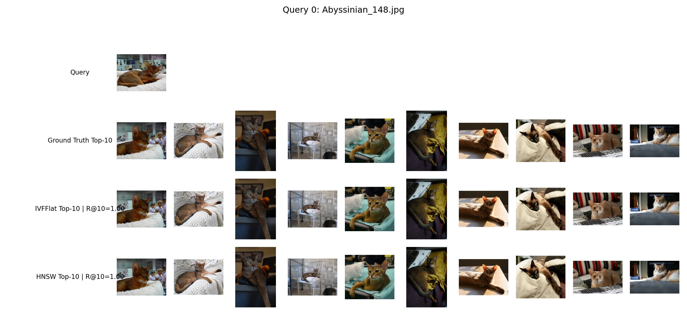
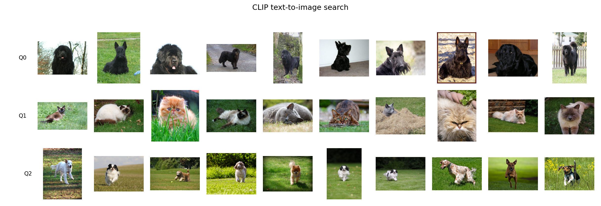
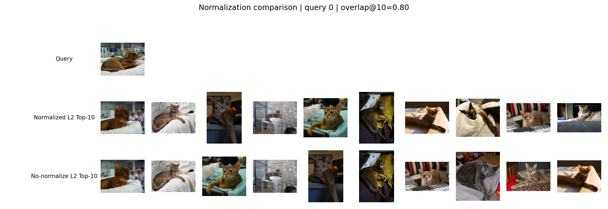

# 图像向量检索实践实验报告

## 1. 实验流程与设置

本实验完成一个小型图像向量检索流程：首先下载并整理 Oxford-IIIT Pet 图像数据集，然后使用 CLIP ViT-B/32 图像编码器将图片转换为向量；接着将全量向量随机划分为 base 向量集合和 query 向量集合；再使用 FAISS `IndexFlatL2` 精确检索生成 ground truth top10；最后使用 `IndexIVFFlat` 和 `IndexHNSWFlat` 两种近似最近邻索引完成检索，并统计索引构建时间、索引大小、QPS 和 Recall@10。

本实验还完成了 Bonus 2 和 Bonus 3：Bonus 2 将图搜图扩展为 CLIP 文本搜图；Bonus 3 比较 L2 normalization 对检索结果排序的影响。

### 1.1 数据集

- 数据集名称：Oxford-IIIT Pet
- 数据集来源：https://www.robots.ox.ac.uk/~vgg/data/pets/
- 实际使用图片数量：7349 张有效图片
- 标注信息：包含 37 个猫狗品种类别，并包含 species、breed id 等标注
- 子集抽取方式：未抽取子集，使用脚本整理出的全部有效图片

### 1.2 Embedding 模型

- 主实验模型：CLIP ViT-B/32 图像编码器
- 输入类型：RGB 图像
- 输出向量维度：768
- 向量数据类型：float32
- 是否归一化：是，使用 L2 normalization
- 加速方式：使用本机 NVIDIA GPU/CUDA 进行 CLIP 前向推理，PyTorch CUDA 版本为 cu132
- 是否支持文本搜图：CLIP 支持图文统一向量空间；主实验只做图搜图，Bonus 2 使用 CLIP 共享空间做文本搜图

### 1.3 Base/Query 划分与 Ground Truth

- 随机种子：42
- Query 数量：100
- Base 数量：7249
- 划分方式：随机选取 100 张图片作为 query，其余图片作为 base，query 图片不出现在 base 中
- Ground truth 生成方式：使用 FAISS `IndexFlatL2` 对每条 query 在 base 集合上进行精确 L2 检索，保存 top10 结果

### 1.4 ANNS 索引方法

本实验选择两种 FAISS ANNS 方法：

- `IndexIVFFlat`：主要参数为 `nlist=100, nprobe=10`
- `IndexHNSWFlat`：主要参数为 `M=32, efConstruction=80, efSearch=64`

`IndexFlatL2` 只用于生成 ground truth，不作为近似检索方法参与对比。

## 2. 实验结果统计

| 指标 | 第一组 | 第二组 |
|---|---:|---:|
| 数据集名称 | Oxford-IIIT Pet | Oxford-IIIT Pet |
| Embedding 模型 | CLIP ViT-B/32 | CLIP ViT-B/32 |
| 向量维度 | 768 | 768 |
| 向量数据类型 | float32 | float32 |
| Base 向量数量 | 7249 | 7249 |
| Base 向量大小 MB | 21.24 | 21.24 |
| Query 向量数量 | 100 | 100 |
| 索引方法 | IndexIVFFlat | IndexHNSWFlat |
| 索引主要参数 | nlist=100, nprobe=10 | M=32, efConstruction=80, efSearch=64 |
| 索引构建时间 ms | 73.01 | 141.92 |
| 索引占用空间 MB | 21.59 | 23.12 |
| 检索耗时 s | 0.002 | 0.003 |
| QPS | 46027.80 | 36639.43 |
| Recall@10 | 0.985 | 0.998 |

## 3. 主实验检索结果可视化

图中第 1 行为 query 图片，第 2 行为 ground truth top10，第 3 行为 IVFFlat top10，第 4 行为 HNSW top10。对 query 0 而言，HNSW 的 Recall@10 更高，整体更接近 ground truth；IVFFlat 也已经达到较高召回，但个别位置可能与精确检索结果不同。由于 ground truth 也是基于 CLIP embedding 的 L2 距离得到，若出现人眼看来不完全相似的图片，更可能来自 embedding 对语义、姿态、颜色和主体区域的综合表征，而不是单纯的 ANNS 误差。

## 4. 结果分析

### 4.1 ANNS 方法的速度与召回率对比

从 Recall@10 看，HNSW 达到 0.998，高于 IVFFlat 的 0.985，说明在当前参数下 HNSW 与精确检索结果更一致。从 QPS 看，IVFFlat 为 46027.80，高于 HNSW 的 36639.43。这体现了近似搜索中的典型权衡：更高的搜索质量通常会带来额外的搜索或图遍历开销。

### 4.2 索引大小与构建时间

IVFFlat 的索引大小约为 21.59 MB，构建时间约为 73.01 ms；HNSW 的索引大小约为 23.12 MB，构建时间约为 141.92 ms。HNSW 需要额外保存近邻图结构，因此索引文件略大，构建时间也更长。IVFFlat 需要训练倒排聚类中心并在查询时访问部分倒排桶，`nprobe` 越大通常 Recall 越高，但 QPS 可能下降。

### 4.3 Embedding 表征对结果的影响

CLIP embedding 更偏语义相似，而不仅是像素级相似。因此检索结果可能更关注动物类别、姿态、主体位置、颜色和场景语义。例如不同品种的猫或狗，如果姿态、颜色、背景或语义描述接近，也可能被排在一起。ANNS 返回结果与 ground truth 不一致时，需要区分两类原因：一类是近似检索没有完全找到精确 top10，另一类是 embedding 本身定义的相似度与人眼直觉不同。

### 4.4 当前流程的不足与改进方向

本实验只使用一种主实验 embedding 模型和两种 ANNS 索引。后续可以尝试 ResNet50、DINOv2、SigLIP 等模型，比较不同 embedding 对“相似图片”的定义；也可以系统调节 IVF 的 `nprobe`、HNSW 的 `efSearch`，画出 Recall@10、QPS 和索引大小之间的折中曲线。此外，本实验的 QPS 由 100 条 query 统计得到，样本较少，实际工程中可增加 query 数量并重复测量以获得更稳定的吞吐估计。

## 5. Bonus 2：文本搜图

Bonus 2 使用 CLIP 的图文共享向量空间，将文本 query 与 base 图片映射到同一个 512 维空间中，再使用 FAISS `IndexFlatL2` 检索 top10 图片。实验使用 3 条文本 query：`a black dog`、`a cat lying on grass`、`a dog running on grass`。

| 文本 query | Top5 类别概览 |
|---|---|
| a black dog | newfoundland, scottish_terrier, newfoundland, newfoundland, newfoundland |
| a cat lying on grass | Siamese, Birman, Persian, Birman, British_Shorthair |
| a dog running on grass | english_setter, japanese_chin, wheaten_terrier, english_cocker_spaniel, pomeranian |

从结果看，`a black dog` 主要召回 Newfoundland、Scottish Terrier 等黑色犬类图片；`a cat lying on grass` 主要召回 Siamese、Birman、Persian、British Shorthair 等猫类图片；`a dog running on grass` 主要召回 English Setter、Japanese Chin、Wheaten Terrier 等犬类图片。整体上，CLIP 能较好利用文本语义进行跨模态检索，但返回结果不一定严格等同于人工标签匹配，因为文本描述、图像背景和 CLIP 训练语义都会影响排序。

## 6. Bonus 3：归一化影响对比

Bonus 3 在相同 CLIP 图像编码器、相同数据集和相同 query 划分下，对比 L2 normalization 与不归一化两种设置。对 100 条 query 的 top10 结果进行集合重合度统计，平均 overlap@10 为 0.940，最低 overlap@10 为 0.8，其中 57 条 query 的 top10 集合或排序出现变化。

归一化后，每个向量的模长被固定，使用 L2 距离检索时更接近比较向量方向，也就是接近余弦相似度；未归一化时，向量模长也会参与距离计算，因此排序可能发生变化。本实验平均 overlap@10 较高，说明两种设置下的大部分近邻保持一致；但部分 query 的结果变化说明 normalization 仍会影响相似图片排序。

## 7. 遇到的问题与解决方案

1. Python 和深度学习依赖兼容性：使用 Python 3.10 conda 环境，避免过新 Python 版本导致 PyTorch、FAISS 安装不稳定。
2. CUDA 加速配置：本机 PyTorch 使用 cu132 wheel，`torch.cuda.is_available()` 为 True，embedding 阶段使用 `--device cuda` 加速。
3. CSV 写出字段不匹配：实验脚本中结果字典包含 `search_time_sec`、`results_ivecs`、`index_path`，已将这些字段加入 `metrics.csv` 表头，保证指标正常写出。
4. Transformers 版本差异：当前 Transformers 版本中 `CLIPModel.get_image_features()` 返回模型输出对象，Bonus 2 脚本改为显式调用 `vision_model/text_model` 并通过 projection 层生成 512 维共享向量。

## 8. 输出文件清单

- 主实验指标：`outputs/metrics.csv`、`outputs/metrics.json`
- 主实验可视化：`outputs/query0_visualization.png`
- Bonus 2 文本搜图：`outputs/bonus2_text_search_results.csv`、`outputs/bonus2_text_search.png`
- Bonus 3 归一化对比：`outputs/bonus3_normalization_compare.csv`、`outputs/bonus3_query0_compare.png`
